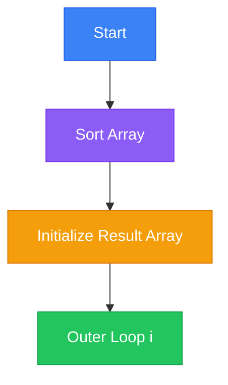

# 4Sum Algorithm

## Basic Information
- **ID**: 0018-4sum
- **Title**: 4Sum
- **Description**: Find all unique quadruplets in an array that sum up to a given target.
- **Difficulty**: Medium
- **Category**: Array
- **Time Complexity**: O(n^3)
- **Space Complexity**: O(n)
- **Popularity**: 85
- **Estimated Time**: 30 min
- **Real World Use**: Financial calculations, data analysis

## Problem Statement
Given an array `nums` of `n` integers, return an array of all the unique quadruplets `[nums[a], nums[b], nums[c], nums[d]]` such that:
- `0 <= a, b, c, d < n`
- `a, b, c, and d` are distinct.
- `nums[a] + nums[b] + nums[c] + nums[d] == target`

You may return the answer in any order.

## Examples

### Example 1
```javascript
Input: nums = [1, 0, -1, 0, -2, 2], target = 0
Output: [[-2, -1, 1, 2], [-2, 0, 0, 2], [-1, 0, 0, 1]]
Explanation: The function finds all quadruplets that sum to 0.
```

### Example 2
```javascript
Input: nums = [2, 2, 2, 2, 2], target = 8
Output: [[2, 2, 2, 2]]
Explanation: Only one quadruplet sums to 8.
```

### Example 3
```javascript
Input: nums = [], target = 0
Output: []
Explanation: No elements to form quadruplets.
```

## Analogy

### Title: The Treasure Hunt

Imagine you are on a treasure hunt with a map that has four distinct landmarks. Your goal is to find all possible routes that connect these landmarks such that the total distance matches a specific target. The landmarks are like the numbers in the array, and the routes are the quadruplets that sum to the target. Just as you would avoid revisiting the same landmark in a single route, the algorithm avoids using the same number more than once in a quadruplet.

**Visual Aid**: Picture a map with paths connecting landmarks, each path representing a potential sum.

## Key Insights
- Sorting the array simplifies the process of finding quadruplets by allowing efficient two-pointer traversal.
- The algorithm uses nested loops to fix two numbers and a two-pointer technique to find the other two numbers.
- It handles duplicates by skipping over repeated numbers to ensure unique quadruplets.

## Real World Applications

### Financial Analysis
**Application**: Portfolio balancing
**Description**: Finding combinations of investments that meet a specific financial target.

### Data Analysis
**Application**: Anomaly detection
**Description**: Identifying sets of data points that together meet a specific criterion.

## Engineering Lessons

### Efficient Search
**Lesson**: Sorting and two-pointer techniques can significantly reduce complexity.
**Application**: Useful in scenarios where multiple combinations need to be evaluated.

### Handling Duplicates
**Lesson**: Skipping duplicates ensures unique results.
**Application**: Critical in data processing tasks where uniqueness is required.

## Implementations

### Optimized Solution
```javascript
/**
 * 18. 4Sum
 * https://leetcode.com/problems/4sum/
 * Difficulty: Medium
 *
 * Given an array nums of n integers, return an array of all the unique
 * quadruplets [nums[a], nums[b], nums[c], nums[d]] such that:
 * - 0 <= a, b, c, d < n
 * - a, b, c, and d are distinct.
 * - nums[a] + nums[b] + nums[c] + nums[d] == target
 *
 * You may return the answer in any order.
 */

/**
 * @param {number[]} nums
 * @param {number} target
 * @return {number[][]}
 */
var fourSum = function(nums, target) {
  const result = [];

  nums.sort((a, b) => a - b);

  for (let i = 0; i < nums.length - 3; i++) {
    for (let j = i + 1; j < nums.length - 2; j++) {
      let high = nums.length - 1;
      let low = j + 1;

      while (low < high) {
        const sum = nums[i] + nums[j] + nums[low] + nums[high];

        if (sum === target) {
          result.push([nums[i], nums[j], nums[low], nums[high]]);
          while (nums[low] === nums[low + 1]) {
            low++;
          }
          while (nums[high] === nums[high - 1]) {
            high--;
          }
          low++;
          high--;
        } else if (sum < target) {
          low++;
        } else {
          high--;
        }
      }
      while (nums[j] === nums[j + 1]) {
        j++;
      }
    }
    while (nums[i] === nums[i + 1]) {
      i++;
    }
  }

  return result;
};
```
**Time Complexity**: O(n^3) due to three nested loops and a two-pointer traversal.
**Space Complexity**: O(n) for storing the result.

## Animation States (Step-by-Step Visualization)

### Mermaid Animation States

#### Step 1: Initialize
**Title**: Initialize and Sort Array
**Description**: Sort the array to facilitate the two-pointer technique.


### D3 Animation States

#### Step 1: Initialize
```json
{
  "step": 1,
  "title": "Initialize and Sort Array",
  "description": "Sort the array to facilitate the two-pointer technique.",
  "data": {
    "array": [
      {"value": -2, "index": 0, "state": "active", "color": "#3b82f6"},
      {"value": -1, "index": 1, "state": "active", "color": "#3b82f6"},
      {"value": 0, "index": 2, "state": "active", "color": "#3b82f6"},
      {"value": 0, "index": 3, "state": "active", "color": "#3b82f6"},
      {"value": 1, "index": 4, "state": "active", "color": "#3b82f6"},
      {"value": 2, "index": 5, "state": "active", "color": "#3b82f6"}
    ],
    "result": [],
    "operation": {
      "type": "Sort",
      "complexity": "O(n log n)",
      "description": "Sort the array to use two-pointer technique"
    }
  }
}
```

### React Flow Animation States

#### Step 1: Initialize
```json
{
  "step": 1,
  "title": "Initialize",
  "description": "Setup phase",
  "data": {
    "nodes": [
      {"id": "start", "type": "input", "data": {"label": "Start", "emoji": "🚀"}, "position": {"x": 250, "y": 0}},
      {"id": "sort", "type": "custom", "data": {"label": "Sort Array", "emoji": "📊"}, "position": {"x": 250, "y": 100}},
      {"id": "result", "type": "custom", "data": {"label": "Result: []", "emoji": "🗂️"}, "position": {"x": 250, "y": 200}}
    ],
    "edges": [
      {"id": "e1", "source": "start", "target": "sort", "animated": true},
      {"id": "e2", "source": "sort", "target": "result", "animated": false}
    ]
  }
}
```

### Three.js Animation States

#### Step 1: Initialize
```json
{
  "step": 1,
  "title": "Initialize 3D Scene",
  "description": "Render array elements as 3D boxes",
  "data": {
    "type": "array",
    "elements": [
      {"value": -2, "x": -3, "y": 0, "z": 0, "color": "#3b82f6", "scale": 1.0},
      {"value": -1, "x": -1, "y": 0, "z": 0, "color": "#3b82f6", "scale": 1.0},
      {"value": 0, "x": 1, "y": 0, "z": 0, "color": "#3b82f6", "scale": 1.0},
      {"value": 0, "x": 3, "y": 0, "z": 0, "color": "#3b82f6", "scale": 1.0},
      {"value": 1, "x": 5, "y": 0, "z": 0, "color": "#3b82f6", "scale": 1.0},
      {"value": 2, "x": 7, "y": 0, "z": 0, "color": "#3b82f6", "scale": 1.0}
    ],
    "target": {"value": 0, "x": 0, "y": 3, "z": 0, "color": "#f59e0b"},
    "camera": {"position": {"x": 0, "y": 2, "z": 8}, "lookAt": {"x": 0, "y": 0, "z": 0}}
  }
}
```

## Educational Content

### Common Mistakes
- Forgetting to sort the array before applying the two-pointer technique.
- Not handling duplicates properly, leading to repeated quadruplets.

### Optimization Tips
- Sorting the array allows for efficient two-pointer traversal.
- Skipping duplicates ensures unique quadruplets.

### Interview Tips
- Explain the importance of sorting and how it enables the two-pointer technique.
- Discuss how you handle duplicates to ensure unique results.

## Testing Scenarios

### Normal Cases
**Scenario**: Standard input
**Input**: `[1, 0, -1, 0, -2, 2]`, `target = 0`
**Expected Output**: `[[-2, -1, 1, 2], [-2, 0, 0, 2], [-1, 0, 0, 1]]`
**Edge Case**: false

### Edge Cases
**Scenario**: All elements are the same
**Input**: `[2, 2, 2, 2, 2]`, `target = 8`
**Expected Output**: `[[2, 2, 2, 2]]`
**Edge Case**: true

**Scenario**: Empty array
**Input**: `[]`, `target = 0`
**Expected Output**: `[]`
**Edge Case**: true

### Performance Cases
**Scenario**: Large input
**Input**: Large dataset with random numbers
**Expected Output**: Correct quadruplets
**Edge Case**: false

## Performance Analysis

### Best Case: O(n^3)
- Occurs when the array is small or the target is easily met with early elements.

### Average Case: O(n^3)
- Typical scenario with random distribution of numbers.

### Worst Case: O(n^3)
- Occurs when the array is large and requires full traversal.

### Space Complexity: O(n)
- Space used by the result array.

### Bottlenecks
- The nested loops and two-pointer traversal can be computationally intensive for large arrays.

### Scalability
- The algorithm scales with the cube of the input size, making it less efficient for very large datasets.

## Code Quality Metrics

### Readability: 8/10
- Clear variable names and logical structure.

### Efficiency: 7/10
- Efficient for moderate-sized arrays but can be slow for very large inputs.

### Maintainability: 8/10
- Well-structured and easy to modify.

### Documentation: 7/10
- Adequate comments explaining key steps.

### Testability: 8/10
- Easy to test with various input scenarios.

### Best Practices
- Sorting before applying two-pointer technique.
- Handling duplicates to ensure unique results.

## Related Algorithms

### Three Sum
**Similarity**: Similar approach with three numbers.
**When to Use**: When looking for triplets instead of quadruplets.

### Two Sum
**Similarity**: Basic version with two numbers.
**When to Use**: When only two numbers are needed.

## Metadata

### Tags
- Array
- Two Pointers
- Sorting
- Combination

### Acceptance Rate: 35%

### Frequency: Medium

### Similar Problems
- Three Sum
- Two Sum
- K Sum

### Difficulty Breakdown
**Understanding**: Medium - Requires understanding of two-pointer technique.
**Implementation**: Medium - Nested loops and pointer management.
**Optimization**: Hard - Efficient handling of duplicates and large datasets.