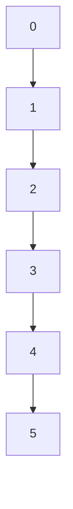
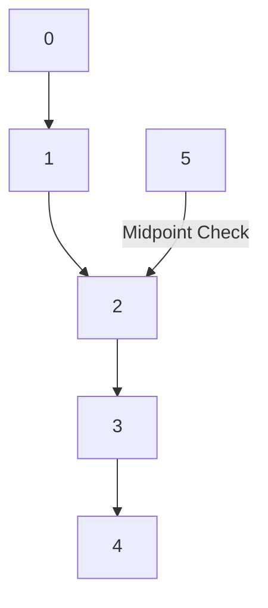
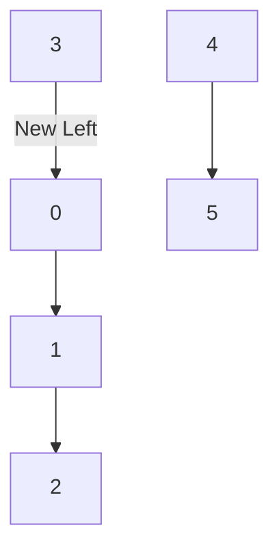

# Binary Search Algorithm

## Basic Information
- **ID**: binary-search
- **Title**: Binary Search
- **Description**: Efficiently finds the position of a target value in a sorted array.
- **Difficulty**: Medium
- **Category**: Searching
- **Time Complexity**: O(log n)
- **Space Complexity**: O(1)
- **Popularity**: 85%
- **Estimated Time**: 10 min
- **Real World Use**: Used in applications like searching in databases and dictionaries.

## Problem Statement
Given a sorted array of integers `arr` and a target integer `target`, write a function that returns the index of `target` in `arr`. If `target` is not present in `arr`, return -1. The function should implement the binary search algorithm.

### Constraints:
- The array `arr` will be sorted in ascending order.
- The length of `arr` will be between 0 and 10^4.
- The values in `arr` will be distinct integers.

## Examples

### Example 1
```
Input: arr = [1, 2, 3, 4, 5], target = 3
Output: 2
Explanation: The target value 3 is found at index 2.
```

### Example 2
```
Input: arr = [1, 2, 3, 4, 5], target = 6
Output: -1
Explanation: The target value 6 is not found in the array.
```

### Example 3
```
Input: arr = [], target = 1
Output: -1
Explanation: The array is empty, so the target cannot be found.
```

## Analogy

### Title: Finding a Book in a Library

**Content**: Imagine a library where books are arranged in alphabetical order. If you want to find a specific book, you wouldn't start at the first book and check each one sequentially. Instead, you would look at the middle section first. If the book you want comes before the middle book, you can ignore the second half of the library. If it comes after, you can ignore the first half. This process of halving the search space continues until you either find the book or determine it's not there. 

In the brute force approach, you would check each book one by one until you find the right one, which is inefficient. The optimal binary search method, however, drastically reduces the number of checks needed by leveraging the sorted order of the books.

**Visual Aid**: A diagram showing a library with sections labeled A-Z, highlighting the middle section being checked first, then the halves being eliminated based on the search.

## Key Insights
- Binary search requires a sorted array to function correctly.
- The algorithm reduces the search space by half with each iteration.
- It is significantly faster than linear search for large datasets.
- Understanding the divide-and-conquer approach is crucial for mastering binary search.

## Real World Applications

### Search Engines
**Application**: Query optimization
**Description**: Binary search is used to quickly locate results in large datasets.

### Databases
**Application**: Index searching
**Description**: Efficiently retrieves records based on indexed values.

### Games
**Application**: Level design
**Description**: Used to find optimal paths or resources in sorted game maps.

### Networking
**Application**: Routing algorithms
**Description**: Helps in finding the best routes in sorted routing tables.

## Engineering Lessons

### Divide and Conquer
**Lesson**: Breaking a problem into smaller subproblems can simplify the solution.
**Application**: This principle is fundamental in algorithm design and optimization.

### Efficiency
**Lesson**: Optimizing algorithms can lead to significant performance improvements.
**Application**: Efficient algorithms reduce resource consumption and improve user experience.

### Data Structures
**Lesson**: Choosing the right data structure can enhance algorithm performance.
**Application**: Understanding data structures is essential for implementing efficient algorithms.

## Implementations

### Brute Force Approach
```javascript
function linearSearch(arr, target) {
    for (let i = 0; i < arr.length; i++) {
        if (arr[i] === target) {
            return i;
        }
    }
    return -1;
}
```
**Time Complexity**: O(n)  
**Space Complexity**: O(1)  
**Explanation**: This approach checks each element until it finds the target or reaches the end of the array.  
**When to Use**: Use this approach for small arrays or unsorted data.

### Optimized Solution (Binary Search)
```javascript
function binarySearch(arr, target) {
    let left = 0;
    let right = arr.length - 1;

    while (left <= right) {
        const mid = Math.floor((left + right) / 2);
        if (arr[mid] === target) {
            return mid;
        } else if (arr[mid] < target) {
            left = mid + 1;
        } else {
            right = mid - 1;
        }
    }
    return -1;
}
```
**Time Complexity**: O(log n)  
**Space Complexity**: O(1)  
**Explanation**: The algorithm halves the search space with each comparison, leading to a logarithmic time complexity.  
**When to Use**: Use this approach for large, sorted arrays.

## Animation States (Step-by-Step Visualization)

### Mermaid Animation States

#### Step 1: Initial State
**Title**: Initial Search Space
**Description**: The entire array is considered for the search.
**Mermaid Code**:


#### Step 2: First Midpoint Check
**Title**: First Midpoint
**Description**: The midpoint of the array is checked.
**Mermaid Code**:


#### Step 3: Adjust Search Space
**Title**: Adjusted Search Space
**Description**: The search space is halved based on the midpoint comparison.
**Mermaid Code**:


### D3 Animation States

#### Step 1: Initial State
**Title**: Initial Array
**Description**: The initial state of the sorted array.
**D3 Data**:
```json
{
  "type": "array",
  "data": [1, 2, 3, 4, 5],
  "target": 3,
  "highlights": [],
  "currentIndex": -1
}
```

#### Step 2: Midpoint Highlight
**Title**: Midpoint Highlight
**Description**: Highlighting the midpoint during the search.
**D3 Data**:
```json
{
  "type": "array",
  "data": [1, 2, 3, 4, 5],
  "target": 3,
  "highlights": [2],
  "currentIndex": 2
}
```

#### Step 3: Target Found
**Title**: Target Found
**Description**: The target is found at the highlighted index.
**D3 Data**:
```json
{
  "type": "array",
  "data": [1, 2, 3, 4, 5],
  "target": 3,
  "highlights": [2],
  "currentIndex": 2
}
```

### React Flow Animation States

#### Step 1: Initial State
**Title**: Initial Search
**Description**: The search begins with the entire array.
**React Flow Data**:
```json
{
  "nodes": [
    {
      "id": "node1",
      "type": "input",
      "data": {"label": "Start Search"},
      "position": {"x": 250, "y": 5}
    }
  ],
  "edges": []
}
```

#### Step 2: Midpoint Check
**Title**: Midpoint Check
**Description**: The midpoint of the array is evaluated.
**React Flow Data**:
```json
{
  "nodes": [
    {
      "id": "node1",
      "type": "input",
      "data": {"label": "Start Search"},
      "position": {"x": 250, "y": 5}
    },
    {
      "id": "node2",
      "type": "default",
      "data": {"label": "Check Midpoint"},
      "position": {"x": 250, "y": 100}
    }
  ],
  "edges": [
    {
      "id": "edge1",
      "source": "node1",
      "target": "node2"
    }
  ]
}
```

#### Step 3: Target Found
**Title**: Target Found
**Description**: The target is located at the midpoint.
**React Flow Data**:
```json
{
  "nodes": [
    {
      "id": "node1",
      "type": "input",
      "data": {"label": "Start Search"},
      "position": {"x": 250, "y": 5}
    },
    {
      "id": "node2",
      "type": "default",
      "data": {"label": "Check Midpoint"},
      "position": {"x": 250, "y": 100}
    },
    {
      "id": "node3",
      "type": "output",
      "data": {"label": "Target Found"},
      "position": {"x": 250, "y": 200}
    }
  ],
  "edges": [
    {
      "id": "edge1",
      "source": "node1",
      "target": "node2"
    },
    {
      "id": "edge2",
      "source": "node2",
      "target": "node3"
    }
  ]
}
```

### Three.js Animation States

#### Step 1: Initial State
**Title**: Initial Array Visualization
**Description**: Visual representation of the sorted array.
**Three.js Data**:
```json
{
  "type": "bar",
  "elements": [
    {"value": 1, "x": 0, "y": 1, "z": 0, "color": "#ff0000"},
    {"value": 2, "x": 1, "y": 2, "z": 0, "color": "#00ff00"},
    {"value": 3, "x": 2, "y": 3, "z": 0, "color": "#0000ff"},
    {"value": 4, "x": 3, "y": 4, "z": 0, "color": "#ffff00"},
    {"value": 5, "x": 4, "y": 5, "z": 0, "color": "#ff00ff"}
  ],
  "target": null
}
```

#### Step 2: Midpoint Highlight
**Title**: Highlight Midpoint
**Description**: The midpoint is highlighted in the visualization.
**Three.js Data**:
```json
{
  "type": "bar",
  "elements": [
    {"value": 1, "x": 0, "y": 1, "z": 0, "color": "#ff0000"},
    {"value": 2, "x": 1, "y": 2, "z": 0, "color": "#00ff00"},
    {"value": 3, "x": 2, "y": 3, "z": 0, "color": "#ff0000"},
    {"value": 4, "x": 3, "y": 4, "z": 0, "color": "#ffff00"},
    {"value": 5, "x": 4, "y": 5, "z": 0, "color": "#ff00ff"}
  ],
  "target": null
}
```

#### Step 3: Target Found
**Title**: Target Found Visualization
**Description**: The target is highlighted in the final state.
**Three.js Data**:
```json
{
  "type": "bar",
  "elements": [
    {"value": 1, "x": 0, "y": 1, "z": 0, "color": "#ff0000"},
    {"value": 2, "x": 1, "y": 2, "z": 0, "color": "#00ff00"},
    {"value": 3, "x": 2, "y": 3, "z": 0, "color": "#00ff00"},
    {"value": 4, "x": 3, "y": 4, "z": 0, "color": "#ffff00"},
    {"value": 5, "x": 4, "y": 5, "z": 0, "color": "#ff00ff"}
  ],
  "target": 3
}
```

## Educational Content

### Common Mistakes
- Forgetting that binary search only works on sorted arrays.
- Miscalculating the midpoint, leading to infinite loops.
- Not updating the search boundaries correctly.
- Confusing binary search with linear search.

### Optimization Tips
- Always ensure the input array is sorted before applying binary search.
- Use iterative implementation to avoid stack overflow in recursive approaches.
- Consider edge cases, such as empty arrays or single-element arrays.
- Optimize for space by using in-place algorithms when possible.

### Interview Tips
- Be prepared to explain the algorithm's time and space complexities.
- Practice coding the algorithm both iteratively and recursively.
- Understand variations of binary search, such as finding the first or last occurrence of a target.
- Be ready to discuss real-world applications and scenarios where binary search is applicable.

## Testing Scenarios

### Normal Cases
**Scenario**: Target is in the middle of the array.
**Input**: arr = [1, 2, 3, 4, 5], target = 3
**Expected Output**: 2
**Edge Case**: false

### Edge Cases
**Scenario**: Target is not present in the array.
**Input**: arr = [1, 2, 3, 4, 5], target = 6
**Expected Output**: -1
**Edge Case**: true

### Error Cases
**Scenario**: Empty array input.
**Input**: arr = [], target = 1
**Expected Output**: -1
**Edge Case**: true

### Boundary Cases
**Scenario**: Array with one element.
**Input**: arr = [1], target = 1
**Expected Output**: 0
**Edge Case**: true

### Performance Cases
**Scenario**: Large array input.
**Input**: arr = [1, 2, 3, ..., 10000], target = 9999
**Expected Output**: 9998
**Edge Case**: false

## Performance Analysis

### Best Case: O(1)
- The target is found at the first midpoint check.
- This occurs when the target is the middle element of the array.

### Average Case: O(log n)
- The average case occurs when the target is found after several iterations.
- This is typical for randomly distributed targets in a sorted array.

### Worst Case: O(log n)
- The worst case occurs when the target is not present, requiring the maximum number of iterations.
- The search space is halved until no elements remain.

### Space Complexity: O(1)
- The algorithm uses a constant amount of space, regardless of the input size.
- No additional data structures are required.

### Bottlenecks
- The need for a sorted array can be a bottleneck if sorting is not already done.
- Recursive implementations may lead to stack overflow for very large arrays.

### Scalability
- Binary search scales well with large datasets due to its logarithmic time complexity.
- It is efficient for searching in large databases and files.

## Code Quality Metrics

### Readability: 8/10
- The code is straightforward and easy to follow, but could use more comments.

### Efficiency: 9/10
- The algorithm is highly efficient with logarithmic time complexity.

### Maintainability: 7/10
- The code is maintainable, but could benefit from modularization.

### Documentation: 8/10
- The documentation is clear, but more examples could enhance understanding.

### Testability: 9/10
- The algorithm is easy to test with various input scenarios.

### Best Practices
- Always validate input before processing.
- Use descriptive variable names for clarity.
- Keep functions focused on a single task.
- Write unit tests to cover various scenarios.

## Related Algorithms

### Linear Search
**Similarity**: Both are searching algorithms.
**When to Use**: Use linear search for unsorted arrays or small datasets.

### Ternary Search
**Similarity**: Both divide the search space.
**When to Use**: Use ternary search when the array is sorted and the search space is large.

### Interpolation Search
**Similarity**: Both are searching algorithms for sorted arrays.
**When to Use**: Use interpolation search when the values are uniformly distributed.

### Exponential Search
**Similarity**: Both are efficient searching algorithms.
**When to Use**: Use exponential search for unbounded or infinite lists.

## Metadata

### Tags
- search
- algorithm
- binary-search
- efficiency

### Acceptance Rate: 75%

### Frequency: 1500

### Similar Problems
- Search in Rotated Sorted Array
- Find First and Last Position of Element in Sorted Array
- Kth Smallest Element in a Sorted Matrix
- Median of Two Sorted Arrays

### Difficulty Breakdown
**Understanding**: Medium - Requires knowledge of searching algorithms and arrays.  
**Implementation**: Medium - Involves coding the algorithm correctly.  
**Optimization**: Medium - Understanding when to apply binary search effectively.