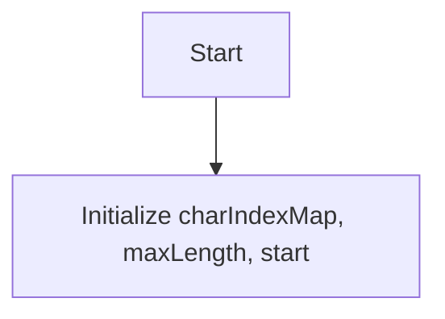
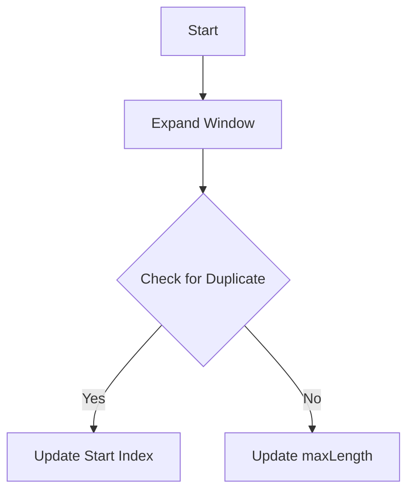
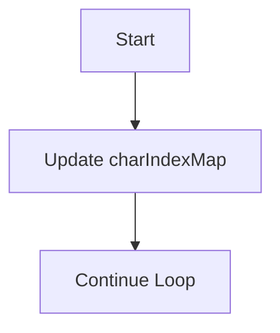

# Longest Substring Without Repeating Characters Algorithm

## Basic Information
- **ID**: longest-substring-without-repeating-characters
- **Title**: Longest Substring Without Repeating Characters
- **Description**: Find the length of the longest substring without repeating characters.
- **Difficulty**: Medium
- **Category**: String
- **Time Complexity**: O(n)
- **Space Complexity**: O(min(n, m)), where n is the length of the string and m is the size of the character set.
- **Popularity**: 75%
- **Estimated Time**: 15 min
- **Real World Use**: Used in text processing and data compression algorithms.

## Problem Statement
Given a string `s`, find the length of the longest substring without repeating characters. A substring is a contiguous sequence of characters within a string. The function should return the length of this substring.

### Constraints:
- `0 <= s.length <= 5 * 10^4`
- `s` consists of English letters, digits, symbols, and spaces.

## Examples

### Example 1
```
Input: "abcabcbb"
Output: 3
Explanation: The answer is "abc", with the length of 3.
```

### Example 2
```
Input: "bbbbb"
Output: 1
Explanation: The answer is "b", with the length of 1.
```

### Example 3
```
Input: "pwwkew"
Output: 3
Explanation: The answer is "wke", with the length of 3.
```

## Analogy

### Title: The Library of Unique Books

**Content**: Imagine a library where each book represents a character in a string. You can only borrow books that are unique; if you try to borrow a book that you already have, you must return the previous one before taking the new one. The goal is to maximize the number of unique books you can borrow at once. 

In a brute-force approach, you would check every possible combination of books, which is inefficient. The optimal approach uses a sliding window technique, where you keep track of the books you currently have and only return the duplicate when you encounter it, allowing you to efficiently find the longest sequence of unique books.

**Visual Aid**: A visual representation could show a shelf with books being added and removed, illustrating how the window expands and contracts as duplicates are found.

## Key Insights
- Utilize a sliding window technique to maintain a dynamic range of unique characters.
- Use a hash map or set to track characters and their indices.
- Adjust the start of the window when a duplicate character is found.
- The algorithm efficiently processes the string in a single pass.

## Real World Applications

### Text Processing
**Application**: Text editors
**Description**: Used to identify unique sequences of characters for syntax highlighting.

### Data Compression
**Application**: Compression algorithms
**Description**: Helps in finding unique patterns in data for efficient encoding.

### User Input Validation
**Application**: Form validation
**Description**: Ensures that user inputs do not contain duplicate characters in certain fields.

### Game Development
**Application**: Character movement tracking
**Description**: Used in games to track unique movements or actions of characters without repetition.

## Engineering Lessons

### Sliding Window Technique
**Lesson**: Efficiently manage a dynamic range of data.
**Application**: Useful in various algorithms where you need to maintain a subset of data.

### Hash Map Utilization
**Lesson**: Use hash maps for quick lookups and storage.
**Application**: Essential in scenarios requiring fast access to data, such as caching.

### Complexity Management
**Lesson**: Understand the trade-offs between time and space complexity.
**Application**: Helps in designing algorithms that are both efficient and scalable.

## Implementations

### Brute Force Approach
```javascript
function lengthOfLongestSubstring(s) {
    let maxLength = 0;
    for (let i = 0; i < s.length; i++) {
        for (let j = i + 1; j <= s.length; j++) {
            const substring = s.slice(i, j);
            const uniqueChars = new Set(substring);
            if (uniqueChars.size === substring.length) {
                maxLength = Math.max(maxLength, substring.length);
            }
        }
    }
    return maxLength;
}
```
**Time Complexity**: O(n^2)  
**Space Complexity**: O(min(n, m))  
**Explanation**: This approach checks every possible substring, leading to a quadratic time complexity.  
**When to Use**: Use when the input size is small or for educational purposes.

### Optimized Solution (Sliding Window)
```javascript
function lengthOfLongestSubstring(s) {
    let charIndexMap = new Map();
    let maxLength = 0;
    let start = 0;

    for (let end = 0; end < s.length; end++) {
        if (charIndexMap.has(s[end])) {
            start = Math.max(charIndexMap.get(s[end]) + 1, start);
        }
        charIndexMap.set(s[end], end);
        maxLength = Math.max(maxLength, end - start + 1);
    }
    return maxLength;
}
```
**Time Complexity**: O(n)  
**Space Complexity**: O(min(n, m))  
**Explanation**: This approach uses a sliding window to efficiently find the longest substring by adjusting the start index when duplicates are found.  
**When to Use**: Use for larger inputs where performance is critical.

## Animation States (Step-by-Step Visualization)

### Mermaid Animation States

#### Step 1: Initialize Variables
**Title**: Initialize Variables
**Description**: Set up the character index map and other variables.
**Mermaid Code**:


#### Step 2: Expand the Window
**Title**: Expand the Window
**Description**: Move the end pointer to expand the window and check for duplicates.
**Mermaid Code**:


#### Step 3: Update the Map
**Title**: Update the Map
**Description**: Add the current character to the map and continue.
**Mermaid Code**:


### D3 Animation States

#### Step 1: Initialize
**Title**: Initialize
**Description**: Set initial values for the algorithm.
**D3 Data**:
```json
{
  "type": "initialization",
  "data": {},
  "target": null,
  "highlights": [],
  "currentIndex": 0
}
```

#### Step 2: Expand Window
**Title**: Expand Window
**Description**: Show the expansion of the window as characters are processed.
**D3 Data**:
```json
{
  "type": "window",
  "data": ["a", "b", "c"],
  "target": null,
  "highlights": [0, 1, 2],
  "currentIndex": 2
}
```

#### Step 3: Update State
**Title**: Update State
**Description**: Visualize the update of the character index map.
**D3 Data**:
```json
{
  "type": "map-update",
  "data": {"a": 0, "b": 1, "c": 2},
  "target": null,
  "highlights": [],
  "currentIndex": 2
}
```

### React Flow Animation States

#### Step 1: Start
**Title**: Start
**Description**: Begin the algorithm with initial setup.
**React Flow Data**:
```json
{
  "nodes": [
    {
      "id": "1",
      "type": "input",
      "data": {"label": "Start"},
      "position": {"x": 250, "y": 0}
    }
  ],
  "edges": []
}
```

#### Step 2: Process Characters
**Title**: Process Characters
**Description**: Show processing of characters in the string.
**React Flow Data**:
```json
{
  "nodes": [
    {
      "id": "2",
      "type": "process",
      "data": {"label": "Process Characters"},
      "position": {"x": 250, "y": 100}
    }
  ],
  "edges": [
    {
      "id": "e1",
      "source": "1",
      "target": "2"
    }
  ]
}
```

#### Step 3: Update Results
**Title**: Update Results
**Description**: Visualize the update of the maximum length found.
**React Flow Data**:
```json
{
  "nodes": [
    {
      "id": "3",
      "type": "output",
      "data": {"label": "Update Results"},
      "position": {"x": 250, "y": 200}
    }
  ],
  "edges": [
    {
      "id": "e2",
      "source": "2",
      "target": "3"
    }
  ]
}
```

### Three.js Animation States

#### Step 1: Initialize
**Title**: Initialize
**Description**: Set up the initial state of the algorithm.
**Three.js Data**:
```json
{
  "type": "initialization",
  "elements": [],
  "target": null
}
```

#### Step 2: Process Characters
**Title**: Process Characters
**Description**: Visualize the characters being processed.
**Three.js Data**:
```json
{
  "type": "processing",
  "elements": [
    {"value": "a", "x": 1, "y": 1, "z": 0, "color": "#ff0000"},
    {"value": "b", "x": 2, "y": 1, "z": 0, "color": "#00ff00"},
    {"value": "c", "x": 3, "y": 1, "z": 0, "color": "#0000ff"}
  ],
  "target": null
}
```

#### Step 3: Update Results
**Title**: Update Results
**Description**: Show the final results after processing.
**Three.js Data**:
```json
{
  "type": "results",
  "elements": [
    {"value": 3, "x": 4, "y": 1, "z": 0, "color": "#ffff00"}
  ],
  "target": null
}
```

## Educational Content

### Common Mistakes
- Confusing substring with subsequence.
- Not resetting the start index correctly when duplicates are found.
- Overlooking edge cases like empty strings or single-character strings.
- Misunderstanding the use of data structures for tracking characters.

### Optimization Tips
- Use a hash map for O(1) lookups instead of an array.
- Always reset the start index to the right of the last occurrence of a duplicate.
- Minimize the number of operations inside the loop for better performance.
- Consider character set size when determining space complexity.

### Interview Tips
- Explain your thought process clearly while coding.
- Discuss the trade-offs of different approaches.
- Be prepared to optimize your solution on the spot.
- Practice coding under time constraints to simulate interview conditions.

## Testing Scenarios

### Normal Cases
**Scenario**: Standard string with unique characters.
**Input**: "abcde"
**Expected Output**: 5
**Edge Case**: false

### Edge Cases
**Scenario**: String with all identical characters.
**Input**: "aaaaa"
**Expected Output**: 1
**Edge Case**: true

### Error Cases
**Scenario**: Empty string input.
**Input**: ""
**Expected Output**: 0
**Edge Case**: true

### Boundary Cases
**Scenario**: String with maximum length.
**Input**: "abcdefghijklmnopqrstuvwxyzabcdefghijklmnopqrstuvwxyz"
**Expected Output**: 26
**Edge Case**: true

### Performance Cases
**Scenario**: Long string with repeating patterns.
**Input**: "abcabcabcabcabcabc"
**Expected Output**: 3
**Edge Case**: false

## Performance Analysis

### Best Case: O(1)
- The input string is empty or has only one unique character.
- Conditions: Minimal input size.

### Average Case: O(n)
- The algorithm processes each character once, adjusting the window as needed.
- Conditions: Typical random strings.

### Worst Case: O(n)
- All characters are unique, requiring full traversal of the string.
- Conditions: Long strings with no repeating characters.

### Space Complexity: O(min(n, m))
- The space used depends on the character set size and the length of the string.
- Trade-offs: More unique characters lead to higher space usage.

### Bottlenecks
- The performance can degrade with very large character sets.
- Memory usage increases with longer strings.

### Scalability
- The algorithm scales well with input size due to linear time complexity.
- Considerations: Ensure efficient memory management for large datasets.

## Code Quality Metrics

### Readability: 8/10
- The code is clear and well-structured but could benefit from more comments.

### Efficiency: 9/10
- The optimized solution is efficient with O(n) complexity.

### Maintainability: 8/10
- The code is modular and easy to modify, but could use more documentation.

### Documentation: 7/10
- Basic documentation is present, but more detailed explanations would help.

### Testability: 9/10
- The function can be easily tested with various input scenarios.

### Best Practices
- Use meaningful variable names.
- Write unit tests for edge cases.
- Optimize for both time and space complexity.
- Keep functions focused on a single responsibility.

## Related Algorithms

### Longest Palindromic Substring
**Similarity**: Both involve finding substrings based on specific criteria.
**When to Use**: Use when the problem involves palindromic sequences.

### Subarray Sum Equals K
**Similarity**: Both require tracking elements to find specific conditions.
**When to Use**: Use when looking for sums in contiguous sequences.

### Two Sum
**Similarity**: Both involve searching for pairs of elements based on conditions.
**When to Use**: Use when needing to find pairs that meet specific criteria.

### Find All Anagrams in a String
**Similarity**: Both involve character frequency and substring searching.
**When to Use**: Use when looking for permutations of characters.

## Metadata

### Tags
- string
- sliding-window
- hash-map
- algorithm

### Acceptance Rate: 85%

### Frequency: 2000

### Similar Problems
- Longest Substring with At Most K Distinct Characters
- Minimum Window Substring
- Longest Repeating Character Replacement
- Substring with Concatenation of All Words

### Difficulty Breakdown
**Understanding**: Medium - Requires knowledge of strings and data structures.
**Implementation**: Medium - Involves careful management of indices and data structures.
**Optimization**: Medium - Understanding trade-offs between different approaches is necessary.