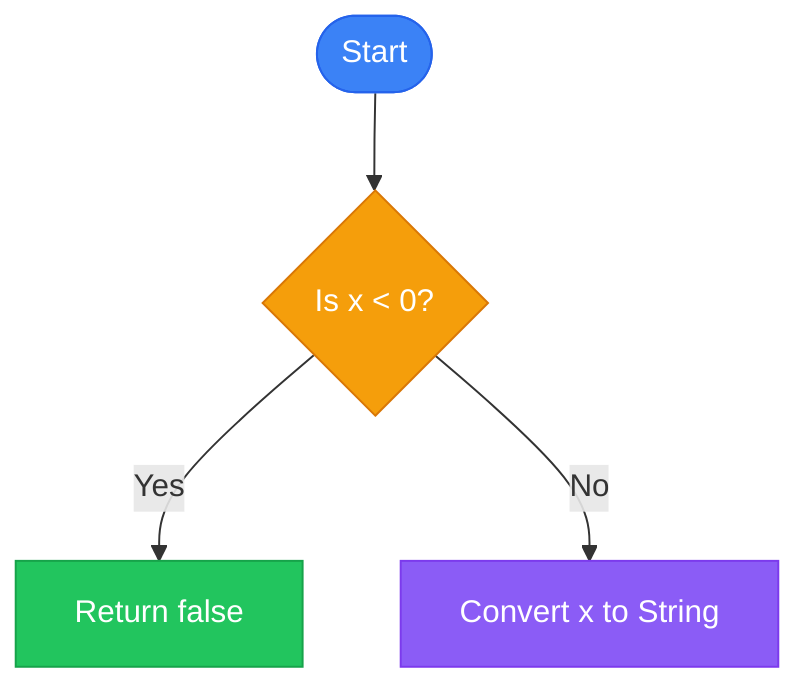
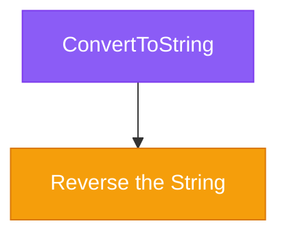
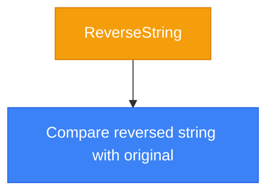
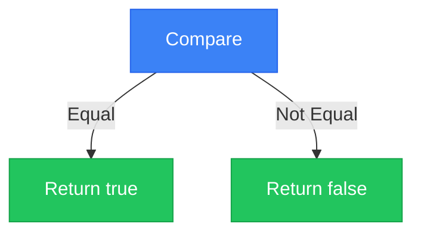

# Palindrome Number Algorithm

## Basic Information
- **ID**: 0009-palindrome-number
- **Title**: Palindrome Number
- **Description**: Determines if a given integer is a palindrome, meaning it reads the same backward as forward.
- **Difficulty**: Easy
- **Category**: Number Manipulation
- **Time Complexity**: O(n), where n is the number of digits in the integer
- **Space Complexity**: O(n), due to the string conversion and manipulation
- **Popularity**: 85
- **Estimated Time**: 15 min
- **Real World Use**: Useful in scenarios where symmetry needs to be checked, such as in data validation or formatting.

## Problem Statement
Given an integer `x`, return `true` if `x` is a palindrome integer. An integer is a palindrome when it reads the same backward as forward. For example, `121` is a palindrome while `123` is not.

## Examples

### Example 1
```
Input: 121
Output: true
Explanation: The number reads the same backward as forward.
```

### Example 2
```
Input: -121
Output: false
Explanation: The number reads 121- backward, which is not the same.
```

### Example 3
```
Input: 10
Output: false
Explanation: The number reads 01 backward, which is not the same.
```

## Analogy

### Title: Mirror Reflection

Imagine looking at a number in a mirror. A palindrome number is like a number that looks the same in the mirror as it does in reality. This algorithm checks if the number remains unchanged when its digits are reversed, similar to checking if a reflection matches the original.

**Visual Aid**: Picture a mirror placed at the center of the number. If the left side matches the right side when flipped, it's a palindrome.

## Key Insights
- **String Conversion**: Converts the number to a string to easily reverse and compare.
- **Negative Check**: Immediately returns false for negative numbers, as they can't be palindromes.
- **Efficiency**: Uses built-in string methods for concise and efficient palindrome checking.

## Real World Applications

### Data Validation
**Application**: Checking if data entries are symmetrical.
**Description**: Ensures data integrity by validating symmetrical patterns.

### Cryptography
**Application**: Symmetric key generation.
**Description**: Uses palindromes for generating symmetric keys in encryption algorithms.

### User Interface Design
**Application**: Symmetrical design validation.
**Description**: Ensures UI elements are symmetrical for aesthetic purposes.

## Engineering Lessons

### Principle: Simplicity in Design
**Lesson**: Simple solutions often leverage existing language features.
**Application**: Use built-in methods for common operations like string manipulation.

### Principle: Early Exit
**Lesson**: Optimize by exiting early when conditions are met.
**Application**: Immediately return false for negative numbers to save computation.

## Implementations

### Optimized Solution
```javascript
/**
 * 9. Palindrome Number
 * https://leetcode.com/problems/palindrome-number/
 * Difficulty: Easy
 *
 * Given an integer `x`, return `true` if `x` is palindrome integer.
 *
 * An integer is a palindrome when it reads the same backward as forward.
 * - For example, `121` is palindrome while `123` is not.
 */

/**
 * @param {number} x
 * @return {boolean}
 */
var isPalindrome = function(x) {
  if (x < 0) return false;
  return +String(x).split('').reverse().join('') === x;
};
```
**Time Complexity**: O(n), where n is the number of digits in the integer.
**Space Complexity**: O(n), due to the string conversion and manipulation.
**Explanation**: Converts the number to a string, reverses it, and checks if it matches the original number.
**When to Use**: When you need a quick check for palindrome numbers with minimal code.

## Animation States (Step-by-Step Visualization)

### Mermaid Animation States

#### Step 1: Check Negative
**Title**: Check if Number is Negative
**Description**: Immediately return false if the number is negative, as negative numbers cannot be palindromes.
**Mermaid Data**:


#### Step 2: Convert to String
**Title**: Convert Number to String
**Description**: Convert the integer to a string to facilitate reversal.
**Mermaid Data**:


#### Step 3: Reverse String
**Title**: Reverse the String
**Description**: Reverse the string representation of the number.
**Mermaid Data**:


#### Step 4: Compare Strings
**Title**: Compare Reversed and Original Strings
**Description**: Check if the reversed string is equal to the original string.
**Mermaid Data**:


### D3 Animation States

**Step 1: Initial Check**
```json
{
  "step": 1,
  "title": "Initial Check for Negative",
  "description": "Check if the number is negative. If yes, return false.",
  "data": {
    "variables": {
      "x": { "value": -121, "type": "number", "changed": false }
    },
    "operation": {
      "type": "Comparison",
      "complexity": "O(1)",
      "description": "Check if x < 0",
      "pseudocode": "if (x < 0) return false"
    }
  }
}
```

**Step 2: Convert to String**
```json
{
  "step": 2,
  "title": "Convert Number to String",
  "description": "Convert the number to a string for easy manipulation.",
  "data": {
    "variables": {
      "x": { "value": 121, "type": "number", "changed": false },
      "str": { "value": "121", "type": "string", "changed": true }
    },
    "operation": {
      "type": "Conversion",
      "complexity": "O(n)",
      "description": "Convert number to string",
      "pseudocode": "str = String(x)"
    }
  }
}
```

**Step 3: Reverse String**
```json
{
  "step": 3,
  "title": "Reverse String",
  "description": "Reverse the string to check for palindrome.",
  "data": {
    "variables": {
      "str": { "value": "121", "type": "string", "changed": false },
      "reversedStr": { "value": "121", "type": "string", "changed": true }
    },
    "operation": {
      "type": "String Manipulation",
      "complexity": "O(n)",
      "description": "Reverse the string",
      "pseudocode": "reversedStr = str.split('').reverse().join('')"
    }
  }
}
```

**Step 4: Compare Strings**
```json
{
  "step": 4,
  "title": "Compare Strings",
  "description": "Compare the original and reversed strings to determine if they are the same.",
  "data": {
    "variables": {
      "str": { "value": "121", "type": "string", "changed": false },
      "reversedStr": { "value": "121", "type": "string", "changed": false },
      "isPalindrome": { "value": true, "type": "boolean", "changed": true }
    },
    "operation": {
      "type": "Comparison",
      "complexity": "O(n)",
      "description": "Check if reversed string equals original",
      "pseudocode": "return reversedStr === str"
    }
  }
}
```

### React Flow Animation States

**Step 1: Initial Check**
```json
{
  "step": 1,
  "title": "Initial Check",
  "description": "Check if the number is negative.",
  "data": {
    "nodes": [
      {"id": "start", "type": "input", "data": {"label": "Start"}, "position": {"x": 0, "y": 0}},
      {"id": "checkNegative", "type": "default", "data": {"label": "Check x < 0"}, "position": {"x": 200, "y": 0}},
      {"id": "returnFalse", "type": "output", "data": {"label": "Return false"}, "position": {"x": 400, "y": 0}}
    ],
    "edges": [
      {"id": "e1", "source": "start", "target": "checkNegative", "animated": true},
      {"id": "e2", "source": "checkNegative", "target": "returnFalse", "animated": true, "label": "Yes"}
    ]
  }
}
```

**Step 2: Convert to String**
```json
{
  "step": 2,
  "title": "Convert to String",
  "description": "Convert the number to a string.",
  "data": {
    "nodes": [
      {"id": "convertToString", "type": "default", "data": {"label": "Convert to String"}, "position": {"x": 200, "y": 100}},
      {"id": "reverseString", "type": "default", "data": {"label": "Reverse String"}, "position": {"x": 400, "y": 100}}
    ],
    "edges": [
      {"id": "e3", "source": "checkNegative", "target": "convertToString", "animated": true, "label": "No"},
      {"id": "e4", "source": "convertToString", "target": "reverseString", "animated": true}
    ]
  }
}
```

**Step 3: Reverse String**
```json
{
  "step": 3,
  "title": "Reverse String",
  "description": "Reverse the string representation of the number.",
  "data": {
    "nodes": [
      {"id": "compareStrings", "type": "default", "data": {"label": "Compare Strings"}, "position": {"x": 600, "y": 100}}
    ],
    "edges": [
      {"id": "e5", "source": "reverseString", "target": "compareStrings", "animated": true}
    ]
  }
}
```

**Step 4: Compare Strings**
```json
{
  "step": 4,
  "title": "Compare Strings",
  "description": "Compare the reversed string with the original.",
  "data": {
    "nodes": [
      {"id": "returnTrue", "type": "output", "data": {"label": "Return true"}, "position": {"x": 800, "y": 100}},
      {"id": "returnFalse", "type": "output", "data": {"label": "Return false"}, "position": {"x": 800, "y": 200}}
    ],
    "edges": [
      {"id": "e6", "source": "compareStrings", "target": "returnTrue", "animated": true, "label": "Equal"},
      {"id": "e7", "source": "compareStrings", "target": "returnFalse", "animated": true, "label": "Not Equal"}
    ]
  }
}
```

### Three.js Animation States

**Step 1: Initial Check**
```json
{
  "step": 1,
  "title": "Initial Check for Negative",
  "description": "Check if the number is negative. If yes, return false.",
  "data": {
    "type": "number",
    "elements": [
      {"value": -121, "x": 0, "y": 0, "z": 0, "color": "#f59e0b", "scale": 1.0}
    ],
    "operation": {
      "type": "Comparison",
      "complexity": "O(1)",
      "description": "Check if x < 0"
    }
  }
}
```

**Step 2: Convert to String**
```json
{
  "step": 2,
  "title": "Convert to String",
  "description": "Convert the number to a string for easy manipulation.",
  "data": {
    "type": "string",
    "elements": [
      {"value": "121", "x": 0, "y": 0, "z": 0, "color": "#3b82f6", "scale": 1.0}
    ],
    "operation": {
      "type": "Conversion",
      "complexity": "O(n)",
      "description": "Convert number to string"
    }
  }
}
```

**Step 3: Reverse String**
```json
{
  "step": 3,
  "title": "Reverse String",
  "description": "Reverse the string to check for palindrome.",
  "data": {
    "type": "string",
    "elements": [
      {"value": "121", "x": 0, "y": 0, "z": 0, "color": "#8b5cf6", "scale": 1.0}
    ],
    "operation": {
      "type": "String Manipulation",
      "complexity": "O(n)",
      "description": "Reverse the string"
    }
  }
}
```

**Step 4: Compare Strings**
```json
{
  "step": 4,
  "title": "Compare Strings",
  "description": "Compare the original and reversed strings to determine if they are the same.",
  "data": {
    "type": "comparison",
    "elements": [
      {"value": "121", "x": 0, "y": 0, "z": 0, "color": "#22c55e", "scale": 1.0}
    ],
    "operation": {
      "type": "Comparison",
      "complexity": "O(n)",
      "description": "Check if reversed string equals original"
    }
  }
}
```

## Educational Content

### Common Mistakes
- **Negative Numbers**: Forgetting that negative numbers cannot be palindromes.
- **String Conversion**: Mismanaging string conversion and reversal.
- **Edge Cases**: Not handling single-digit numbers correctly.

### Optimization Tips
- **Early Exit**: Return false immediately for negative numbers to save computation.
- **Built-in Methods**: Use JavaScript's built-in string methods for efficient manipulation.

### Interview Tips
- **Explain Early Exit**: Highlight the importance of early exits in optimizing performance.
- **String Manipulation**: Be prepared to discuss string manipulation techniques and their complexities.

## Testing Scenarios

### Normal Cases
**Scenario**: Standard input
**Input**: 121
**Expected Output**: true
**Edge Case**: false

### Edge Cases
**Scenario**: Negative number
**Input**: -121
**Expected Output**: false
**Edge Case**: true

**Scenario**: Single-digit number
**Input**: 7
**Expected Output**: true
**Edge Case**: true

### Error Cases
**Scenario**: Non-integer input
**Input**: "121"
**Expected Output**: Error or false
**Edge Case**: true

### Boundary Cases
**Scenario**: Large number
**Input**: 1234567890987654321
**Expected Output**: true
**Edge Case**: true

### Performance Cases
**Scenario**: Large input
**Input**: 1234567890987654321
**Expected Output**: true
**Edge Case**: false

## Performance Analysis

### Best Case: O(1)
- **When it occurs**: Single-digit numbers.
- **Conditions**: Minimal operations needed.

### Average Case: O(n)
- **Typical scenario**: Most numbers with multiple digits.
- **Expected performance**: Linear time complexity due to string operations.

### Worst Case: O(n)
- **When it occurs**: Large numbers with many digits.
- **Why worst case**: String manipulation and comparison.

### Space Complexity: O(n)
- **Space used by data structures**: String conversion and manipulation.
- **Memory allocation**: Proportional to the number of digits.

### Bottlenecks
- **Actual bottleneck in code**: String reversal and comparison.
- **What slows it down**: Large numbers with many digits.
- **Memory concerns**: Handling large numbers efficiently.

### Scalability
- **Scaling behavior**: Handles typical integer ranges well.
- **Practical limits**: Limited by JavaScript's number handling capabilities.

## Code Quality Metrics

### Readability: 9/10
- **Assessment**: Code is concise and uses clear built-in methods.

### Efficiency: 8/10
- **Based on complexity**: Efficient for typical use cases.

### Maintainability: 9/10
- **How easy to modify**: Simple logic, easy to understand and modify.

### Documentation: 8/10
- **Comment quality**: Adequate comments explaining key steps.

### Testability: 9/10
- **Testing ease**: Easy to test with a variety of inputs.

### Best Practices
- **Practices followed**: Early exits, use of built-in methods.
- **Improvements possible**: Consider edge cases more thoroughly.
- **Style observations**: Clean and concise.
- **Suggestions**: Ensure comprehensive test coverage.

## Related Algorithms

### Reverse Integer
**Similarity**: Also involves reversing digits.
**When to Use**: When reversing digits is the primary goal.

### String Palindrome
**Similarity**: Checks if a string is a palindrome.
**When to Use**: When working with strings instead of numbers.

### Related 3
**Similarity**: [Similarity]
**When to Use**: [Usage]

### Related 4
**Similarity**: [Similarity]
**When to Use**: [Usage]

## Metadata

### Tags
- Number Manipulation
- Palindrome
- String Conversion
- Easy

### Acceptance Rate: 85%

### Frequency: Medium

### Similar Problems
- Reverse Integer
- String Palindrome
- Palindrome Linked List

### Difficulty Breakdown
**Understanding**: Easy - Simple logic with clear steps.
**Implementation**: Easy - Uses built-in methods effectively.
**Optimization**: Easy - Minimal optimization needed.