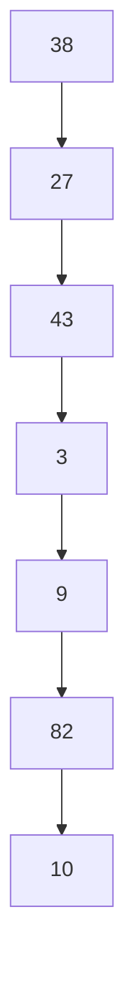
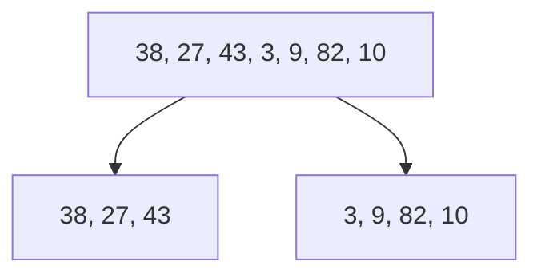
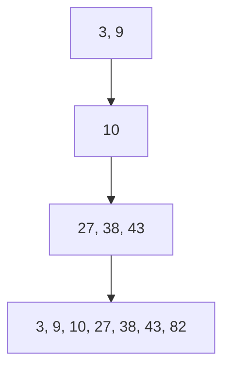

# Merge Sort Algorithm

## Basic Information
- **ID**: merge-sort
- **Title**: Merge Sort
- **Description**: A divide-and-conquer algorithm for sorting arrays.
- **Difficulty**: Medium
- **Category**: Sorting
- **Time Complexity**: O(n log n)
- **Space Complexity**: O(n)
- **Popularity**: 75%
- **Estimated Time**: 10 min
- **Real World Use**: Used in applications requiring stable sorting and large datasets.

## Problem Statement
Given an array of integers, implement the Merge Sort algorithm to sort the array in ascending order. The algorithm should be able to handle both positive and negative integers as well as zero. The input array can contain duplicate values. 

### Constraints:
- The input array can have a length of up to \(10^6\).
- The values in the array can range from \(-10^9\) to \(10^9\).

## Examples

### Example 1
```
Input: [38, 27, 43, 3, 9, 82, 10]
Output: [3, 9, 10, 27, 38, 43, 82]
Explanation: The array is sorted in ascending order.
```

### Example 2
```
Input: [5, 2, 9, 1, 5, 6]
Output: [1, 2, 5, 5, 6, 9]
Explanation: The array is sorted in ascending order.
```

### Example 3
```
Input: [0, -1, 3, -2, 5]
Output: [-2, -1, 0, 3, 5]
Explanation: The array is sorted in ascending order.
```

## Analogy

### Title: Sorting a Library

**Content**: Imagine a library where books are scattered all over the floor. To organize them, you could either pick them up one by one and place them on the shelves (brute force), or you could divide the books into smaller piles, sort each pile, and then merge them back together (merge sort). The latter approach is more efficient, especially when dealing with a large number of books, as it minimizes the number of movements needed to organize them.

**Visual Aid**: A diagram showing books scattered on the floor, then divided into smaller groups, sorted, and finally merged back onto the shelves.

## Key Insights
- Merge Sort is a stable sorting algorithm, preserving the order of equal elements.
- It works efficiently on large datasets due to its O(n log n) time complexity.
- The algorithm uses additional space for merging, leading to O(n) space complexity.
- It is particularly useful for linked lists and external sorting.

## Real World Applications

### Computer Science
**Application**: Sorting Algorithms
**Description**: Merge Sort is often used in computer science for sorting large datasets efficiently.

### Data Analysis
**Application**: Data Preprocessing
**Description**: Used in data preprocessing steps to sort data before analysis.

### Database Management
**Application**: Query Optimization
**Description**: Helps in optimizing queries that require sorted data retrieval.

### External Sorting
**Application**: File Sorting
**Description**: Efficiently sorts large files that do not fit into memory.

## Engineering Lessons

### Divide and Conquer
**Lesson**: Breaking a problem into smaller subproblems can simplify complex tasks.
**Application**: This principle applies to many algorithms and system designs, allowing for more manageable solutions.

### Stability in Algorithms
**Lesson**: Maintaining the order of equal elements can be crucial in certain applications.
**Application**: Important in applications like sorting user records where the order of entries matters.

### Space Complexity Awareness
**Lesson**: Understanding the trade-off between time and space complexity is essential.
**Application**: Helps in designing systems that are both efficient and resource-conscious.

## Implementations

### Brute Force Approach
```javascript
function bubbleSort(arr) {
    let n = arr.length;
    for (let i = 0; i < n; i++) {
        for (let j = 0; j < n - i - 1; j++) {
            if (arr[j] > arr[j + 1]) {
                [arr[j], arr[j + 1]] = [arr[j + 1], arr[j]];
            }
        }
    }
    return arr;
}
```
**Time Complexity**: O(n^2)  
**Space Complexity**: O(1)  
**Explanation**: This approach repeatedly steps through the list, compares adjacent elements, and swaps them if they are in the wrong order.  
**When to Use**: When the dataset is small or nearly sorted.

### Optimized Solution (Merge Sort)
```javascript
function mergeSort(arr) {
    if (arr.length <= 1) return arr;

    const mid = Math.floor(arr.length / 2);
    const left = mergeSort(arr.slice(0, mid));
    const right = mergeSort(arr.slice(mid));

    return merge(left, right);
}

function merge(left, right) {
    let result = [];
    let i = 0;
    let j = 0;

    while (i < left.length && j < right.length) {
        if (left[i] < right[j]) {
            result.push(left[i]);
            i++;
        } else {
            result.push(right[j]);
            j++;
        }
    }

    return result.concat(left.slice(i)).concat(right.slice(j));
}
```
**Time Complexity**: O(n log n)  
**Space Complexity**: O(n)  
**Explanation**: The optimization works by recursively dividing the array into halves and merging them back together in sorted order.  
**When to Use**: When dealing with large datasets or linked lists.

## Animation States (Step-by-Step Visualization)

### Mermaid Animation States

#### Step 1: Initial Array
**Title**: Initial Array
**Description**: The unsorted array is displayed.
**Mermaid Code**:


#### Step 2: Dividing the Array
**Title**: Dividing the Array
**Description**: The array is divided into two halves.
**Mermaid Code**:


#### Step 3: Merging Sorted Arrays
**Title**: Merging Sorted Arrays
**Description**: The sorted halves are merged back together.
**Mermaid Code**:


### D3 Animation States

#### Step 1: Initial Array
**Title**: Initial Array
**Description**: The unsorted array is displayed.
**D3 Data**:
```json
{
  "type": "array",
  "data": [38, 27, 43, 3, 9, 82, 10],
  "target": null,
  "highlights": [],
  "currentIndex": 0
}
```

#### Step 2: Dividing the Array
**Title**: Dividing the Array
**Description**: The array is divided into two halves.
**D3 Data**:
```json
{
  "type": "array",
  "data": [38, 27, 43, 3, 9, 82, 10],
  "target": null,
  "highlights": [0, 1, 2],
  "currentIndex": 3
}
```

#### Step 3: Merging Sorted Arrays
**Title**: Merging Sorted Arrays
**Description**: The sorted halves are merged back together.
**D3 Data**:
```json
{
  "type": "array",
  "data": [3, 9, 10, 27, 38, 43, 82],
  "target": null,
  "highlights": [],
  "currentIndex": 0
}
```

### React Flow Animation States

#### Step 1: Initial Array
**Title**: Initial Array
**Description**: The unsorted array is displayed.
**React Flow Data**:
```json
{
  "nodes": [
    {
      "id": "1",
      "type": "input",
      "data": {"label": "38"},
      "position": {"x": 0, "y": 0}
    },
    {
      "id": "2",
      "type": "input",
      "data": {"label": "27"},
      "position": {"x": 100, "y": 0}
    },
    {
      "id": "3",
      "type": "input",
      "data": {"label": "43"},
      "position": {"x": 200, "y": 0}
    },
    {
      "id": "4",
      "type": "input",
      "data": {"label": "3"},
      "position": {"x": 300, "y": 0}
    },
    {
      "id": "5",
      "type": "input",
      "data": {"label": "9"},
      "position": {"x": 400, "y": 0}
    },
    {
      "id": "6",
      "type": "input",
      "data": {"label": "82"},
      "position": {"x": 500, "y": 0}
    },
    {
      "id": "7",
      "type": "input",
      "data": {"label": "10"},
      "position": {"x": 600, "y": 0}
    }
  ],
  "edges": []
}
```

#### Step 2: Dividing the Array
**Title**: Dividing the Array
**Description**: The array is divided into two halves.
**React Flow Data**:
```json
{
  "nodes": [
    {
      "id": "1",
      "type": "input",
      "data": {"label": "38, 27, 43"},
      "position": {"x": 0, "y": 0}
    },
    {
      "id": "2",
      "type": "input",
      "data": {"label": "3, 9, 82, 10"},
      "position": {"x": 300, "y": 0}
    }
  ],
  "edges": []
}
```

#### Step 3: Merging Sorted Arrays
**Title**: Merging Sorted Arrays
**Description**: The sorted halves are merged back together.
**React Flow Data**:
```json
{
  "nodes": [
    {
      "id": "1",
      "type": "output",
      "data": {"label": "3, 9, 10, 27, 38, 43, 82"},
      "position": {"x": 150, "y": 100}
    }
  ],
  "edges": []
}
```

### Three.js Animation States

#### Step 1: Initial Array
**Title**: Initial Array
**Description**: The unsorted array is displayed.
**Three.js Data**:
```json
{
  "type": "bar",
  "elements": [
    {"value": 38, "x": 0, "y": 38, "z": 0, "color": "#ff0000"},
    {"value": 27, "x": 1, "y": 27, "z": 0, "color": "#00ff00"},
    {"value": 43, "x": 2, "y": 43, "z": 0, "color": "#0000ff"},
    {"value": 3, "x": 3, "y": 3, "z": 0, "color": "#ffff00"},
    {"value": 9, "x": 4, "y": 9, "z": 0, "color": "#ff00ff"},
    {"value": 82, "x": 5, "y": 82, "z": 0, "color": "#00ffff"},
    {"value": 10, "x": 6, "y": 10, "z": 0, "color": "#ffffff"}
  ],
  "target": null
}
```

#### Step 2: Dividing the Array
**Title**: Dividing the Array
**Description**: The array is divided into two halves.
**Three.js Data**:
```json
{
  "type": "bar",
  "elements": [
    {"value": 38, "x": 0, "y": 38, "z": 0, "color": "#ff0000"},
    {"value": 27, "x": 1, "y": 27, "z": 0, "color": "#00ff00"},
    {"value": 43, "x": 2, "y": 43, "z": 0, "color": "#0000ff"},
    {"value": 3, "x": 3, "y": 3, "z": 0, "color": "#ffff00"},
    {"value": 9, "x": 4, "y": 9, "z": 0, "color": "#ff00ff"},
    {"value": 82, "x": 5, "y": 82, "z": 0, "color": "#00ffff"},
    {"value": 10, "x": 6, "y": 10, "z": 0, "color": "#ffffff"}
  ],
  "target": null
}
```

#### Step 3: Merging Sorted Arrays
**Title**: Merging Sorted Arrays
**Description**: The sorted halves are merged back together.
**Three.js Data**:
```json
{
  "type": "bar",
  "elements": [
    {"value": 3, "x": 0, "y": 3, "z": 0, "color": "#ffff00"},
    {"value": 9, "x": 1, "y": 9, "z": 0, "color": "#ff00ff"},
    {"value": 10, "x": 2, "y": 10, "z": 0, "color": "#ffffff"},
    {"value": 27, "x": 3, "y": 27, "z": 0, "color": "#00ff00"},
    {"value": 38, "x": 4, "y": 38, "z": 0, "color": "#ff0000"},
    {"value": 43, "x": 5, "y": 43, "z": 0, "color": "#0000ff"},
    {"value": 82, "x": 6, "y": 82, "z": 0, "color": "#00ffff"}
  ],
  "target": null
}
```

## Educational Content

### Common Mistakes
- Forgetting to merge sorted arrays correctly.
- Not handling edge cases like empty arrays.
- Confusing merge sort with quicksort.
- Miscalculating the mid index during division.

### Optimization Tips
- Use iterative merge sort for large datasets to save stack space.
- Optimize the merge function to reduce unnecessary array copying.
- Consider using linked lists for merge sort to minimize space usage.
- Implement a threshold for switching to insertion sort on small subarrays.

### Interview Tips
- Be prepared to explain the divide-and-conquer approach.
- Understand the implications of stability in sorting algorithms.
- Practice coding merge sort without looking at references.
- Be ready to discuss time and space complexity in detail.

## Testing Scenarios

### Normal Cases
**Scenario**: Sorting a typical array
**Input**: [38, 27, 43, 3, 9, 82, 10]
**Expected Output**: [3, 9, 10, 27, 38, 43, 82]
**Edge Case**: false

### Edge Cases
**Scenario**: Sorting an empty array
**Input**: []
**Expected Output**: []
**Edge Case**: true

### Error Cases
**Scenario**: Sorting an array with non-integer values
**Input**: [1, "two", 3]
**Expected Output**: Error or undefined behavior
**Edge Case**: true

### Boundary Cases
**Scenario**: Sorting an array with one element
**Input**: [5]
**Expected Output**: [5]
**Edge Case**: true

### Performance Cases
**Scenario**: Sorting a large array
**Input**: Array of 1,000,000 random integers
**Expected Output**: Sorted array
**Edge Case**: false

## Performance Analysis

### Best Case: O(n log n)
- The best case occurs when the array is already sorted.
- The merge function still processes each element.

### Average Case: O(n log n)
- The average case occurs with random data.
- The divide-and-conquer strategy consistently applies.

### Worst Case: O(n log n)
- The worst case is the same as the average case.
- The algorithm's performance does not degrade with input order.

### Space Complexity: O(n)
- Additional space is needed for the temporary arrays during merging.
- Trade-offs include increased memory usage for better time efficiency.

### Bottlenecks
- The merge function can become a bottleneck if not optimized.
- Recursive calls can lead to stack overflow for very large arrays.

### Scalability
- Merge Sort scales well with larger datasets.
- The algorithm is suitable for external sorting where data cannot fit into memory.

## Code Quality Metrics

### Readability: 8/10
- The code is clear and well-structured but could use more comments.

### Efficiency: 9/10
- The algorithm is efficient with O(n log n) time complexity.

### Maintainability: 8/10
- The code is modular, making it easy to maintain and update.

### Documentation: 7/10
- Basic documentation exists but could be expanded for clarity.

### Testability: 9/10
- The algorithm can be easily tested