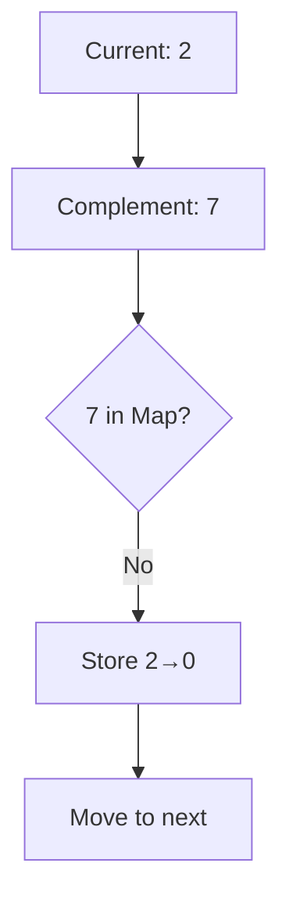

# Two Sum Algorithm

## Basic Information
- **ID**: two-sum
- **Title**: Two Sum
- **Description**: Find two numbers in an array that add up to a target sum
- **Difficulty**: Easy
- **Category**: Array
- **Time Complexity**: O(n)
- **Space Complexity**: O(n)
- **Popularity**: 95
- **Estimated Time**: 15 min
- **Real World Use**: E-commerce recommendation systems, financial transaction matching

## Problem Statement
Given an array of integers `nums` and an integer `target`, return indices of the two numbers such that they add up to `target`.

You may assume that each input would have exactly one solution, and you may not use the same element twice.

You can return the answer in any order.

## Examples

### Example 1
```
Input: nums = [2,7,11,15], target = 9
Output: [0,1]
Explanation: Because nums[0] + nums[1] == 9, we return [0, 1].
```

### Example 2
```
Input: nums = [3,2,4], target = 6
Output: [1,2]
Explanation: Because nums[1] + nums[2] == 6, we return [1, 2].
```

### Example 3
```
Input: nums = [3,3], target = 6
Output: [0,1]
Explanation: Because nums[0] + nums[1] == 6, we return [0, 1].
```

## Analogy

### Title: Finding Dance Partners

**Content**: Imagine you're organizing a dance competition where each dancer has a skill level (number), and you need to find pairs whose combined skill levels equal exactly 10 points.

**The Naive Approach (Brute Force):** You'd ask each dancer to try dancing with every other dancer until you find a perfect match. This is like checking every possible pair in the array - slow and inefficient!

**The Smart Approach (Hash Map):** Instead, you create a "compatibility board" where you write down what skill level each dancer needs in a partner. As each dancer arrives, you check the board - if someone already needs their exact skill level, you've found a match instantly!

This is exactly how the Two Sum algorithm works - the hash map is your "compatibility board" that remembers what numbers you're looking for.

**Visual Aid**: Picture a dance floor with dancers wearing numbered jerseys. A scoreboard shows "NEEDS: 8" when dancer #2 arrives (target 10 - 2 = 8). When dancer #8 arrives, they immediately pair up!

## Key Insights
- Hash maps trade space for time - we use O(n) extra space to achieve O(n) time complexity
- The complement approach: instead of checking all pairs, we look for the 'missing piece'
- One-pass solution: we can build the hash map and find the answer simultaneously
- This pattern applies to many 'find pair that satisfies condition' problems

## Real World Applications

### E-commerce
**Application**: Product recommendation systems
**Description**: Find products that together meet a customer's budget or combine to create bundles

### Finance
**Application**: Transaction matching
**Description**: Match debit and credit transactions, or find transactions that sum to suspicious amounts

### Gaming
**Application**: Team balancing
**Description**: Match players with complementary skill levels to create balanced teams

### Logistics
**Application**: Load optimization
**Description**: Find packages that together fill a container to optimal capacity

## Engineering Lessons

### Space-Time Tradeoffs
**Lesson**: Sometimes using more memory can dramatically improve performance
**Application**: Consider caching, memoization, and lookup tables in system design

### Hash-based Optimization
**Lesson**: Hash maps provide O(1) average lookup time for key-value relationships
**Application**: Use hash maps for deduplication, caching, and fast lookups in distributed systems

### Complement Thinking
**Lesson**: Instead of checking all combinations, think about what you need to complete the solution
**Application**: API design, database queries, and system integration patterns

## Implementations

### Brute Force Approach
```
function twoSum(nums, target) {
    for (let i = 0; i < nums.length; i++) {
        for (let j = i + 1; j < nums.length; j++) {
            if (nums[i] + nums[j] === target) {
                return [i, j];
            }
        }
    }
    return [];
}
```
**Time Complexity**: O(n²)
**Space Complexity**: O(1)
**Explanation**: Check every possible pair in the array
**When to Use**: Small arrays where simplicity matters more than performance

### Optimized Solution (Hash Map)
```
function twoSum(nums, target) {
    const map = new Map();

    for (let i = 0; i < nums.length; i++) {
        const complement = target - nums[i];

        if (map.has(complement)) {
            return [map.get(complement), i];
        }

        map.set(nums[i], i);
    }

    return [];
}
```
**Time Complexity**: O(n)
**Space Complexity**: O(n)
**Explanation**: Use a hash map to store seen numbers and check for complements
**When to Use**: Large arrays where performance is critical

## Animation States (Step-by-Step Visualization)

### Mermaid Animation States

#### Step 1: Initialize
**Title**: Algorithm Overview
**Description**: Find two numbers in an array that add up to a target sum
**Mermaid Code**:
```mermaid
graph TD
    A[Input Array: [2,7,11,15]] --> B[Target: 9]
    C[Hash Map: {}] --> D[Current Index: 0]
```

#### Step 2: Process First Element
**Title**: Check Complement for 2
**Description**: Calculate complement (9-2=7) and check if it exists in hash map
**Mermaid Code**:


#### Step 3: Find Solution
**Title**: Found Match!
**Description**: Complement 2 exists in hash map at index 0
**Mermaid Code**:
```mermaid
graph TD
    A[Current: 7] --> B[Complement: 2]
    B --> C{2 in Map?}
    C -->|Yes at index 0| D[Return [0,1]]
    D --> E[✅ Solution Found]
```

### D3 Animation States

#### Step 1: Array Initialization
**Title**: Initialize Array
**Description**: Set up the array with values [2,7,11,15] and target 9
**D3 Data**:
```json
{
  "type": "array",
  "data": [2, 7, 11, 15],
  "target": 9,
  "highlights": [],
  "currentIndex": -1
}
```

#### Step 2: Hash Map Creation
**Title**: Create Hash Map
**Description**: Initialize empty hash map to store seen values
**D3 Data**:
```json
{
  "type": "hashmap",
  "data": {},
  "currentOperation": "initialize"
}
```

#### Step 3: First Element Processing
**Title**: Process Element 2
**Description**: Check if complement (7) exists, then store 2→0
**D3 Data**:
```json
{
  "type": "array",
  "data": [2, 7, 11, 15],
  "target": 9,
  "highlights": [0],
  "currentIndex": 0,
  "complement": 7,
  "hashMap": {}
}
```

#### Step 4: Second Element Processing
**Title**: Process Element 7
**Description**: Check if complement (2) exists in hash map
**D3 Data**:
```json
{
  "type": "array",
  "data": [2, 7, 11, 15],
  "target": 9,
  "highlights": [1],
  "currentIndex": 1,
  "complement": 2,
  "hashMap": {"2": 0},
  "found": true
}
```

#### Step 5: Solution Found
**Title**: Solution Complete
**Description**: Return indices [0,1] where values sum to target
**D3 Data**:
```json
{
  "type": "array",
  "data": [2, 7, 11, 15],
  "target": 9,
  "highlights": [0, 1],
  "currentIndex": 1,
  "solution": [0, 1],
  "complete": true
}
```

### React Flow Animation States

#### Step 1: Flow Setup
**Title**: Initialize Flow
**Description**: Set up the algorithm flow diagram
**React Flow Data**:
```json
{
  "nodes": [
    {
      "id": "start",
      "type": "input",
      "data": {"label": "Start"},
      "position": {"x": 250, "y": 25}
    },
    {
      "id": "array",
      "data": {"label": "Array: [2,7,11,15]\nTarget: 9"},
      "position": {"x": 250, "y": 100}
    },
    {
      "id": "hashmap",
      "data": {"label": "HashMap: {}"},
      "position": {"x": 100, "y": 175}
    }
  ],
  "edges": [
    {"id": "e1", "source": "start", "target": "array"},
    {"id": "e2", "source": "array", "target": "hashmap"}
  ]
}
```

#### Step 2: Processing Loop
**Title**: Processing Elements
**Description**: Iterate through array checking complements
**React Flow Data**:
```json
{
  "nodes": [
    {
      "id": "loop",
      "type": "default",
      "data": {"label": "For each element i"},
      "position": {"x": 250, "y": 250}
    },
    {
      "id": "check",
      "data": {"label": "Check if target-nums[i]\nin HashMap"},
      "position": {"x": 250, "y": 325}
    }
  ],
  "edges": [
    {"id": "e3", "source": "hashmap", "target": "loop"},
    {"id": "e4", "source": "loop", "target": "check"}
  ]
}
```

#### Step 3: Solution Path
**Title**: Found Solution
**Description**: Complement found, return indices
**React Flow Data**:
```json
{
  "nodes": [
    {
      "id": "found",
      "type": "output",
      "data": {"label": "Found! Return [0,1]"},
      "position": {"x": 400, "y": 400}
    }
  ],
  "edges": [
    {"id": "e5", "source": "check", "target": "found", "label": "Yes"}
  ]
}
```

### Three.js Animation States

#### Step 1: 3D Array Setup
**Title**: 3D Array Visualization
**Description**: Create 3D representation of the array
**Three.js Data**:
```json
{
  "type": "array",
  "elements": [
    {"value": 2, "x": 0, "y": 0, "z": 0, "color": "#3498db"},
    {"value": 7, "x": 2, "y": 0, "z": 0, "color": "#3498db"},
    {"value": 11, "x": 4, "y": 0, "z": 0, "color": "#3498db"},
    {"value": 15, "x": 6, "y": 0, "z": 0, "color": "#3498db"}
  ],
  "target": 9
}
```

#### Step 2: Hash Map Visualization
**Title**: Hash Map 3D View
**Description**: Show hash map as 3D structure
**Three.js Data**:
```json
{
  "type": "hashmap",
  "buckets": [],
  "currentOperation": "initialize"
}
```

#### Step 3: Element Highlighting
**Title**: Process Current Element
**Description**: Highlight current element and show complement search
**Three.js Data**:
```json
{
  "type": "array",
  "elements": [
    {"value": 2, "x": 0, "y": 0, "z": 0, "color": "#e74c3c", "highlight": true},
    {"value": 7, "x": 2, "y": 0, "z": 0, "color": "#3498db"},
    {"value": 11, "x": 4, "y": 0, "z": 0, "color": "#3498db"},
    {"value": 15, "x": 6, "y": 0, "z": 0, "color": "#3498db"}
  ],
  "complement": 7,
  "searching": true
}
```

#### Step 4: Solution Animation
**Title**: Solution Found
**Description**: Animate the solution with connecting elements
**Three.js Data**:
```json
{
  "type": "solution",
  "solutionElements": [
    {"index": 0, "value": 2},
    {"index": 1, "value": 7}
  ],
  "connection": {"start": [0, 0, 0], "end": [2, 0, 0]},
  "celebration": true
}
```

## Educational Content

### Common Mistakes
- Forgetting to handle the case where the same element appears twice
- Not considering negative numbers in the array
- Assuming the array is sorted (it's not guaranteed)
- Using nested loops without optimization awareness

### Optimization Tips
- Use a hash map for O(1) lookups instead of searching
- Consider space constraints when choosing between hash map and sorting approaches
- For sorted arrays, consider the two-pointer technique
- Think about edge cases before implementing

### Interview Tips
- Explain the time and space complexity trade-offs clearly
- Mention alternative approaches and when to use them
- Discuss edge cases like duplicate values or empty arrays
- Show understanding of hash map internals and collision handling

## Testing Scenarios

### Normal Cases
**Scenario**: Standard two sum problem
**Input**: nums = [2,7,11,15], target = 9
**Expected Output**: [0,1]
**Edge Case**: false

### Duplicate Values
**Scenario**: Array with duplicate values
**Input**: nums = [3,3], target = 6
**Expected Output**: [0,1]
**Edge Case**: false

### Negative Numbers
**Scenario**: Array with negative numbers
**Input**: nums = [-1,-2,-3,-4,-5], target = -8
**Expected Output**: [2,4]
**Edge Case**: false

### No Solution
**Scenario**: No pair sums to target
**Input**: nums = [1,2,3,4], target = 10
**Expected Output**: []
**Edge Case**: true

### Single Element
**Scenario**: Array with only one element
**Input**: nums = [5], target = 5
**Expected Output**: []
**Edge Case**: true

## Performance Analysis

### Best Case: O(1)
- When the solution is found on the first complement check
- Extremely rare in practice

### Average Case: O(n)
- Linear time complexity for typical inputs
- Each element is processed once

### Worst Case: O(n)
- When solution is at the end or doesn't exist
- Still linear due to hash map operations

### Space Complexity: O(n)
- Hash map stores up to n elements
- Required for the algorithm to work efficiently

### Bottlenecks
- Hash map operations (insert/lookup) can be slow with poor hash functions
- Memory usage scales with input size
- Worst-case hash collisions could degrade performance

### Scalability
- Excellent for large datasets due to O(n) time complexity
- Memory usage is the main constraint
- Suitable for real-time applications with large inputs

## Code Quality Metrics

### Readability: 9/10
- Clear variable names and comments
- Straightforward logic flow
- Easy to understand the algorithm

### Efficiency: 9/10
- Optimal time complexity for the problem
- Good space-time trade-off
- No unnecessary operations

### Maintainability: 8/10
- Modular code structure
- Easy to modify for variations
- Well-documented edge cases

### Documentation: 8/10
- Good inline comments
- Clear function documentation
- Missing some edge case documentation

### Testability: 9/10
- Easy to unit test with various inputs
- Deterministic behavior
- Clear input/output specifications

### Best Practices
- Use const for immutable variables
- Proper error handling for edge cases
- Clear separation of concerns
- Consistent coding style
- Good use of ES6 features

## Related Algorithms

### Three Sum
**Similarity**: Extension of two sum to find three numbers
**When to Use**: Need to find three elements that sum to target

### Two Sum II (Sorted Array)
**Similarity**: Two sum variant for sorted arrays
**When to Use**: Input array is already sorted

### Four Sum
**Similarity**: Further extension to find four numbers
**When to Use**: Need quadruplets that sum to target

### Subarray Sum Equals K
**Similarity**: Find subarrays that sum to target value
**When to Use**: Need contiguous subarray sums

## Metadata

### Tags
- array
- hash-table
- two-pointers
- easy

### Acceptance Rate: 50%

### Frequency: 50

### Similar Problems
- 1. Two Sum
- 15. 3Sum
- 18. 4Sum
- 167. Two Sum II - Input Array Is Sorted
- 560. Subarray Sum Equals K

### Difficulty Breakdown
**Understanding**: Medium - Need to understand complement approach
**Implementation**: Easy - Straightforward hash map usage
**Optimization**: Medium - Understanding space-time trade-offs
