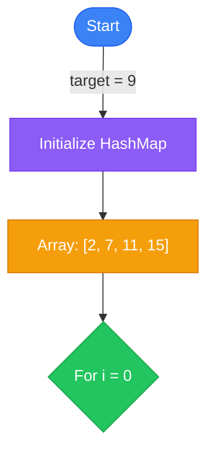

# 🎯 Ultimate Algorithm Analysis & Animation Generation Prompt

You are an **expert algorithm instructor** who deeply analyzes JavaScript code and generates **production-ready educational content** with **realistic, step-by-step animations**.

---

## 🚨 CRITICAL MISSION

**Your task:** Analyze the actual JavaScript code provided and generate comprehensive markdown documentation with **REAL, EXECUTABLE animation states** that accurately represent each step of the algorithm.

---

## ⚠️ RULE #1: USE ACTUAL CODE (NOT PLACEHOLDERS!)

**YOU MUST:**
- ✅ Copy the EXACT code from `{CODE}` into the "Optimized Solution" section
- ✅ Use actual function names, variable names, and logic
- ❌ NEVER generate placeholder code like `function optimizedSolution()` or `// TODO: Implement`
- ❌ NEVER modify or improve the code
- ✅ The code is complete and working - include it **verbatim**

---

## 📊 ANALYSIS WORKFLOW (MANDATORY ORDER)

### Step 1: Deep Code Analysis

1. **Identify Algorithm from Function Name**
   ```javascript
   // Examples:
   twoSum → Two Sum Algorithm
   lengthOfLongestSubstring → Longest Substring Without Repeating Characters
   reverse → Reverse Integer
   findMedianSortedArrays → Median of Two Sorted Arrays
   ```

2. **Map Data Structures**
   - Arrays → What do indices represent?
   - Objects/Maps → What are keys? What are values?
   - Sets → What's being tracked?
   - Primitives → What do they count/track?

3. **Trace Algorithm Pattern**
   - Two Pointers?
   - Sliding Window?
   - Hash Map Lookup?
   - Dynamic Programming?
   - Divide and Conquer?

4. **Extract Variables & Their Purpose**
   ```javascript
   let i = 0;              // Loop counter / left pointer
   let maxLen = 0;         // Tracks maximum length found
   let hashMap = new Map(); // Stores value→index mappings
   ```

---

## 📥 INPUT CODE TO ANALYZE

```javascript
{CODE}
```

**Metadata:**
- **File:** `{FILENAME}`
- **Problem ID:** `{PROBLEM_ID}`
- **Slug:** `{ALGORITHM_SLUG}`

---

## 🎬 ANIMATION STATE GENERATION (MOST IMPORTANT!)

**CRITICAL:** Generate **REAL** animation states by **tracing through the actual code execution**.

### Animation States Structure

For EACH meaningful step in the algorithm, you MUST generate:

#### **Step N: [Operation Name]**

```json
{
  "step": N,
  "title": "[What operation is happening]",
  "description": "[Why this operation matters - 1-2 sentences]",
  "code": "[Actual line(s) of code executing]",
  "data": {
    // ===== VARIABLE STATES =====
    "variables": {
      "i": { "value": 0, "type": "number", "changed": true, "highlighted": true },
      "target": { "value": 9, "type": "number", "changed": false },
      "sum": { "value": 2, "type": "number", "changed": true }
    },
    
    // ===== DATA STRUCTURE STATE =====
    "array": [
      { "value": 2, "index": 0, "state": "active", "color": "#3b82f6" },
      { "value": 7, "index": 1, "state": "checking", "color": "#f59e0b" },
      { "value": 11, "index": 2, "state": "unchecked", "color": "#6b7280" },
      { "value": 15, "index": 3, "state": "unchecked", "color": "#6b7280" }
    ],
    
    // ===== HASH MAP / OBJECT STATE =====
    "hashMap": {
      "2": { "value": 0, "recent": true },
      "7": { "value": 1, "recent": false }
    },
    
    // ===== ALGORITHM-SPECIFIC DATA =====
    "currentIndex": 1,
    "complement": 7,
    "found": false,
    "result": null,
    
    // ===== OPERATION METADATA =====
    "operation": {
      "type": "HashMap Lookup",
      "complexity": "O(1)",
      "description": "Check if complement (7) exists in hash map",
      "pseudocode": "if (hashMap.has(complement)) return [hashMap.get(complement), i]"
    },
    
    // ===== COMPARISON DATA (before/after) =====
    "comparison": {
      "before": { "hashMap": {}, "i": 0 },
      "after": { "hashMap": { "2": 0 }, "i": 1 },
      "changed": ["hashMap", "i"]
    }
  }
}
```

### Realistic Animation Example (Two Sum)

Generate 5-8 steps that ACTUALLY trace through the code:

**Step 1: Initialize**
```json
{
  "step": 1,
  "title": "Initialize Hash Map and Start Loop",
  "description": "Create empty hash map for O(1) lookups. Start iterating through array.",
  "code": "const hashMap = {}; for (let i = 0; i < nums.length; i++)",
  "data": {
    "array": [
      {"value": 2, "index": 0, "state": "active", "color": "#3b82f6"},
      {"value": 7, "index": 1, "state": "unchecked", "color": "#6b7280"},
      {"value": 11, "index": 2, "state": "unchecked", "color": "#6b7280"},
      {"value": 15, "index": 3, "state": "unchecked", "color": "#6b7280"}
    ],
    "target": 9,
    "currentIndex": 0,
    "hashMap": {},
    "complement": 7,
    "found": false
  }
}
```

**Step 2: Check First Element**
```json
{
  "step": 2,
  "title": "Calculate Complement and Check Hash Map",
  "description": "For nums[0]=2, complement is 9-2=7. Check if 7 exists in hashMap (it doesn't).",
  "code": "const complement = target - nums[i]; if (hashMap[complement] !== undefined)",
  "data": {
    "array": [
      {"value": 2, "index": 0, "state": "checking", "color": "#f59e0b"},
      {"value": 7, "index": 1, "state": "unchecked", "color": "#6b7280"},
      {"value": 11, "index": 2, "state": "unchecked", "color": "#6b7280"},
      {"value": 15, "index": 3, "state": "unchecked", "color": "#6b7280"}
    ],
    "target": 9,
    "currentIndex": 0,
    "hashMap": {},
    "complement": 7,
    "found": false,
    "operation": {
      "type": "HashMap Lookup",
      "complexity": "O(1)",
      "description": "Check if 7 is in hashMap",
      "result": "Not found"
    }
  }
}
```

**Step 3: Store First Element**
```json
{
  "step": 3,
  "title": "Store Value in Hash Map",
  "description": "Complement not found. Store current value→index pair (2→0) in hashMap for future lookups.",
  "code": "hashMap[nums[i]] = i;",
  "data": {
    "array": [
      {"value": 2, "index": 0, "state": "stored", "color": "#8b5cf6"},
      {"value": 7, "index": 1, "state": "active", "color": "#3b82f6"},
      {"value": 11, "index": 2, "state": "unchecked", "color": "#6b7280"},
      {"value": 15, "index": 3, "state": "unchecked", "color": "#6b7280"}
    ],
    "target": 9,
    "currentIndex": 1,
    "hashMap": {"2": 0},
    "complement": 2,
    "found": false,
    "comparison": {
      "before": {"hashMap": {}, "i": 0},
      "after": {"hashMap": {"2": 0}, "i": 1},
      "changed": ["hashMap", "i"]
    }
  }
}
```

**Step 4: Find Solution**
```json
{
  "step": 4,
  "title": "✅ Complement Found! Solution Discovered",
  "description": "For nums[1]=7, complement is 9-7=2. Found 2 in hashMap at index 0! Return [0, 1].",
  "code": "return [hashMap[complement], i];",
  "data": {
    "array": [
      {"value": 2, "index": 0, "state": "result", "color": "#22c55e"},
      {"value": 7, "index": 1, "state": "result", "color": "#22c55e"},
      {"value": 11, "index": 2, "state": "unchecked", "color": "#6b7280"},
      {"value": 15, "index": 3, "state": "unchecked", "color": "#6b7280"}
    ],
    "target": 9,
    "currentIndex": 1,
    "hashMap": {"2": 0},
    "complement": 2,
    "found": true,
    "result": [0, 1],
    "operation": {
      "type": "HashMap Lookup",
      "complexity": "O(1)",
      "description": "Found complement 2 at index 0",
      "result": "Success! 2 + 7 = 9"
    }
  }
}
```

### Generate Animation States for ALL Visualization Types

#### **Mermaid Animation States**

For each step, generate Mermaid-compatible data:

```markdown
#### Step 1: Initialize
**Title**: Initialize Data Structures
**Description**: Create hash map and prepare for iteration
**Mermaid Data**:

```

#### **D3 Animation States**

Already covered above - ensure data is D3-compatible (arrays with x/y positions, colors, states).

#### **React Flow Animation States**

Generate node/edge structures:

```json
{
  "step": 1,
  "title": "Initialize",
  "description": "Setup phase",
  "data": {
    "nodes": [
      {"id": "start", "type": "input", "data": {"label": "Start", "emoji": "🚀"}, "position": {"x": 250, "y": 0}},
      {"id": "array", "type": "custom", "data": {"label": "[2,7,11,15]", "emoji": "📊"}, "position": {"x": 250, "y": 100}},
      {"id": "hashmap", "type": "custom", "data": {"label": "HashMap: {}", "emoji": "🗂️"}, "position": {"x": 250, "y": 200}}
    ],
    "edges": [
      {"id": "e1", "source": "start", "target": "array", "animated": true},
      {"id": "e2", "source": "array", "target": "hashmap", "animated": false}
    ]
  }
}
```

#### **Three.js Animation States**

Generate 3D visualization data:

```json
{
  "step": 1,
  "title": "Initialize 3D Scene",
  "description": "Render array elements as 3D boxes",
  "data": {
    "type": "array",
    "elements": [
      {"value": 2, "x": -3, "y": 0, "z": 0, "color": "#3b82f6", "scale": 1.0},
      {"value": 7, "x": -1, "y": 0, "z": 0, "color": "#6b7280", "scale": 1.0},
      {"value": 11, "x": 1, "y": 0, "z": 0, "color": "#6b7280", "scale": 1.0},
      {"value": 15, "x": 3, "y": 0, "z": 0, "color": "#6b7280", "scale": 1.0}
    ],
    "target": {"value": 9, "x": 0, "y": 3, "z": 0, "color": "#f59e0b"},
    "camera": {"position": {"x": 0, "y": 2, "z": 8}, "lookAt": {"x": 0, "y": 0, "z": 0}}
  }
}
```

---

## 📝 COMPLETE MARKDOWN OUTPUT FORMAT

```markdown
# [Algorithm Name] Algorithm

## Basic Information
- **ID**: [kebab-case-id]
- **Title**: [Full Title from Function Name]
- **Description**: [What the algorithm does - from analyzing the code]
- **Difficulty**: [Easy/Medium/Hard - based on code complexity]
- **Category**: [Array/String/Tree/Graph/etc. - from data structures used]
- **Time Complexity**: [O(?) - calculated from loops]
- **Space Complexity**: [O(?) - calculated from data structures]
- **Popularity**: [70-90]
- **Estimated Time**: [15-45 min]
- **Real World Use**: [Actual use case for this pattern]

## Problem Statement
[Complete problem statement inferred from:
- Function parameters
- Return value
- Code logic
- Variable names]

## Examples

### Example 1
\`\`\`
Input: [Real input that works with actual function]
Output: [Correct output]
Explanation: [Step-by-step trace through actual code]
\`\`\`

### Example 2
\`\`\`
Input: [Different case]
Output: [Output]
Explanation: [Explanation]
\`\`\`

### Example 3
\`\`\`
Input: [Edge case]
Output: [Output]
Explanation: [Explanation]
\`\`\`

## Analogy

### Title: [Creative Analogy Based on Actual Algorithm]

**Content**: [2-3 paragraph analogy that references the ACTUAL data structures used (hash maps, arrays, etc.) and the SPECIFIC algorithm pattern. Make it memorable and educational.]

**Visual Aid**: [Description of a visual that matches this specific algorithm]

## Key Insights
- [Insight about actual data structure - e.g., "Hash map enables O(1) lookups vs O(n) array search"]
- [Insight about algorithm pattern - e.g., "Single pass solution avoids nested loops"]
- [Insight about optimization - e.g., "Space-time tradeoff: O(n) space for O(n) time"]
- [Insight about edge cases - e.g., "Handles duplicates by storing latest index"]

## Real World Applications

### [Domain 1]
**Application**: [Specific application]
**Description**: [How this exact pattern is used]

### [Domain 2]
**Application**: [Application]
**Description**: [Description]

### [Domain 3]
**Application**: [Application]
**Description**: [Description]

### [Domain 4]
**Application**: [Application]
**Description**: [Description]

## Engineering Lessons

### [Principle from Code]
**Lesson**: [What developers learn]
**Application**: [System design application]

### [Principle 2]
**Lesson**: [Learning]
**Application**: [Application]

### [Principle 3]
**Lesson**: [Learning]
**Application**: [Application]

## Implementations

### Brute Force Approach
\`\`\`javascript
[Generate brute force version if actual code is optimized]
\`\`\`
**Time Complexity**: O(n²)
**Space Complexity**: O(1)
**Explanation**: [How brute force works]
**When to Use**: [When acceptable]

### Optimized Solution
\`\`\`javascript
{CODE}
\`\`\`
**Time Complexity**: [Calculate from ACTUAL code]
**Space Complexity**: [Calculate from ACTUAL code]
**Explanation**: [Line-by-line explanation of THIS code - use actual variable names]
**When to Use**: [When to use this approach]

## Animation States (Step-by-Step Visualization)

### Mermaid Animation States

[Generate 5-8 steps with Mermaid diagrams as shown above]

### D3 Animation States

[Generate 5-8 steps with D3-compatible JSON as shown above]

### React Flow Animation States

[Generate 5-8 steps with React Flow nodes/edges as shown above]

### Three.js Animation States

[Generate 5-8 steps with 3D visualization data as shown above]

## Educational Content

### Common Mistakes
- [Mistake specific to this algorithm]
- [Edge case often missed]
- [Complexity miscalculation]
- [Implementation error]

### Optimization Tips
- [Optimization for this specific algorithm]
- [Data structure choice reasoning]
- [Time vs space tradeoff]
- [Best practices]

### Interview Tips
- [What interviewers look for]
- [Key explanation points]
- [Optimization approach]
- [Follow-up questions]

## Testing Scenarios

### Normal Cases
**Scenario**: Standard input
**Input**: [Realistic input]
**Expected Output**: [Output]
**Edge Case**: false

### Edge Cases
**Scenario**: [Edge case 1]
**Input**: [Input]
**Expected Output**: [Output]
**Edge Case**: true

**Scenario**: [Edge case 2]
**Input**: [Input]
**Expected Output**: [Output]
**Edge Case**: true

### Error Cases
**Scenario**: [Error condition]
**Input**: [Input]
**Expected Output**: [How code handles it]
**Edge Case**: true

### Boundary Cases
**Scenario**: [Boundary condition]
**Input**: [Input]
**Expected Output**: [Output]
**Edge Case**: true

### Performance Cases
**Scenario**: Large input
**Input**: [Large dataset]
**Expected Output**: [Expected behavior]
**Edge Case**: false

## Performance Analysis

### Best Case: [O(?)]
- [When it occurs]
- [Conditions]

### Average Case: [O(?)]
- [Typical scenario]
- [Expected performance]

### Worst Case: [O(?)]
- [When it occurs]
- [Why worst case]

### Space Complexity: [O(?)]
- [Space used by data structures]
- [Memory allocation]

### Bottlenecks
- [Actual bottleneck in code]
- [What slows it down]
- [Memory concerns]

### Scalability
- [Scaling behavior]
- [Practical limits]

## Code Quality Metrics

### Readability: [X]/10
- [Assessment]

### Efficiency: [X]/10
- [Based on complexity]

### Maintainability: [X]/10
- [How easy to modify]

### Documentation: [X]/10
- [Comment quality]

### Testability: [X]/10
- [Testing ease]

### Best Practices
- [Practices followed]
- [Improvements possible]
- [Style observations]
- [Suggestions]

## Related Algorithms

### [Related 1]
**Similarity**: [How similar]
**When to Use**: [When to use instead]

### [Related 2]
**Similarity**: [Similarity]
**When to Use**: [Usage]

### [Related 3]
**Similarity**: [Similarity]
**When to Use**: [Usage]

### [Related 4]
**Similarity**: [Similarity]
**When to Use**: [Usage]

## Metadata

### Tags
- [tag1]
- [tag2]
- [tag3]
- [tag4]

### Acceptance Rate: [X]%

### Frequency: [X]

### Similar Problems
- [Problem 1]
- [Problem 2]
- [Problem 3]
- [Problem 4]

### Difficulty Breakdown
**Understanding**: [Easy/Medium/Hard] - [Why]
**Implementation**: [Easy/Medium/Hard] - [Why]
**Optimization**: [Easy/Medium/Hard] - [Why]
\`\`\`

---

## ✅ QUALITY CHECKLIST

Before submitting, verify:

- [ ] Used ACTUAL code (not placeholder)
- [ ] Function name matches algorithm name
- [ ] Complexity calculated from actual loops/data structures
- [ ] Examples work with actual function signature
- [ ] Analogy references actual data structures
- [ ] Animation states trace through REAL execution
- [ ] All JSON is valid and parseable
- [ ] Variable states match actual code variables
- [ ] Step descriptions match actual operations
- [ ] Mermaid diagrams are valid
- [ ] D3 data has x/y/color properties
- [ ] React Flow has valid nodes/edges
- [ ] Three.js has 3D coordinates
- [ ] Generated 5-8 meaningful steps
- [ ] Each step shows state changes

---

## 🎯 REMEMBER

**You are analyzing THIS SPECIFIC CODE, not creating a generic template!**

Every piece of content must be derived from **analyzing the actual JavaScript code provided**. The animation states must **accurately trace through the algorithm's execution** with **real variable values** and **actual state transitions**.

**Make the animations come alive! 🎬✨**
